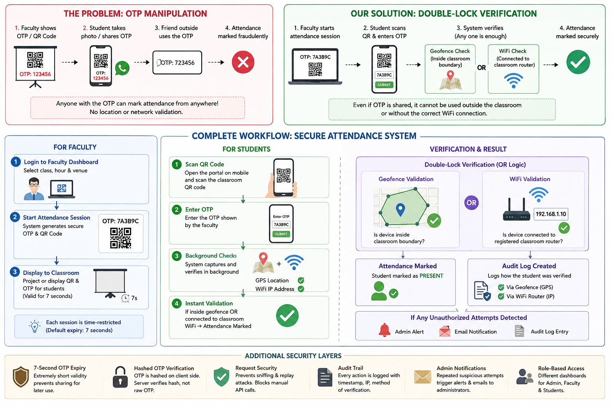
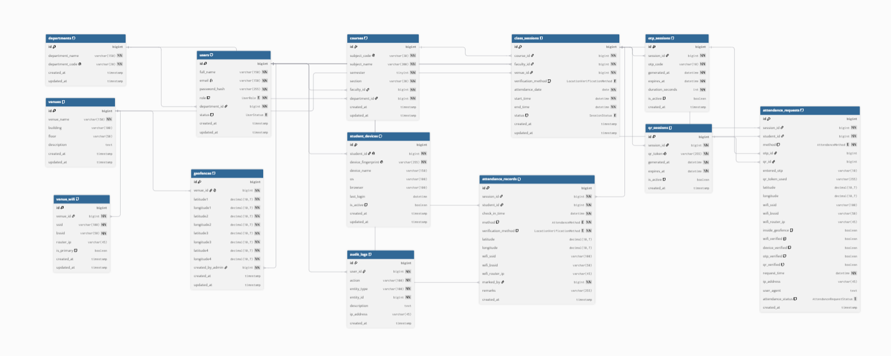

# Attendance Monitoring with QR Code Check-in

### 🚀 Hackathon Project Reference

> **🌐 Live Demo:** [https://pcdp-v4.bitsathy.in](https://pcdp-v4.bitsathy.in/)

---

## 👥 Team Details

| | |
|---|---|
| **Team Name** | Team Dynamic |
| **Institution** | Bannari Amman Institute of Technology |
| **Team Leader** | Thillainathan S |
| **Team Members** | Jaison David M, Sanjay M |
| **Year** | 2026 |

---

## 🎨 UI/UX Design (Figma)

The complete UI/UX design prototype for this project was crafted in Figma:

🔗 **[View Figma Design – TEAM DYNAMICS](https://www.figma.com/design/mKhML6UidHn7HS4MexHyVF/TEAM-DYNAMICS?node-id=0-1)**

---

## 📋 Software Requirements Specification (SRS)

The full SRS document outlining functional requirements, system architecture, and use cases:

🔗 **[View SRS Document on Banani](https://app.banani.co/preview/-2SNztMxCEj5?screen=SRS-Presentation)**

**Attendance Monitoring with QR Code Check-in** is an intelligent, high-trust classroom attendance system designed to eliminate "proxy" attendance and check-in manipulation. By combining location verification, local campus network validation, and secure cryptographic handshakes, the system guarantees that attendance can only be marked by students physically present in the classroom.

---

## 🌟 The Core Problem: OTP Manipulation & Proxies

Traditional classroom attendance methods—and even basic digital barcode/OTP systems—suffer from key security vulnerabilities:
1. **The Remote Sharing Exploit**: A student in class takes a photo of the projected OTP/QR code and messages it to their friends who are outside the classroom or in their hostel rooms.
2. **Delayed Check-Ins**: Sharing code snapshots allows classmates to mark themselves present hours later or from completely different locations.

---

## 🛡️ Our Solution: How it Solves Attendance Exploits

This system solves the proxy problem by enforcing **Double-Lock Verification** using location boundaries, local WiFi connections, and request security mechanisms.

### 1. Hybrid "OR" Verification
To successfully submit an attendance code, the system validates the student using two independent checks. **If either validation is successful, attendance is marked:**
* ***Digital Geofencing (Classroom Boundaries)***: The system draws a precise virtual polygon around the physical classroom. The student's device must be within these GPS coordinates.
* ***WiFi Router Matching (Campus Network)***: The system detects the student's connection IP address and verifies it against the specific physical routers installed inside that classroom. 

*Why this works:* A student sitting in the hostel cannot mark attendance because they are outside the classroom coordinates and not connected to that room's specific WiFi router—even if a friend sends them the OTP code.

### 2. Time-Restricted Sessions (7 Seconds Expiry)
Attendance codes are dynamically generated and expire automatically after 7 seconds. This creates a tiny window of opportunity that prevents sharing codes for later use.

### Hashed OTP Verification
To prevent students from sniffing/monitoring HTTP request payloads and manually marking attendance using external platforms like Postman, the system employs a secure hashing algorithm. 
* **Client-Side Hashing**: The student's device hashes the OTP code before transmitting it.
* **Backend Validation**: The Go backend verifies and validates the hashed value rather than raw texts, blocking requests from being intercepted and replayed manually.

### 3. Clear Verification Audits
Administrative panels log exactly how each student was verified (e.g., *"Verified via classroom WiFi Router (IP: 192.168.1.10)"* or *"Verified via Geofence GPS Coordinates"*). This creates a high-trust verification trail.

### 4. Admin Threat Notifications & Logs
If any user attempts to perform unauthorized actions repeatedly (again and again), the system automatically acts to flag the behavior:
* **Admin Notifications & Mail**: The system triggers real-time alerts and dispatches emails to the administrator using the Go backend's `gomail` integration.
* **Audit Inspection**: Admins can instantly review the logs to trace the actor's history, specific actions, timestamps, and client IP addresses.

---

## 👥 Roles & Feature List

The console supports three distinct roles (Admin, Faculty, and Student) with role-specific workspaces and workflows.

### 1. System Administrator Dashboard
The Admin console provides full system configuration and monitoring capabilities:
* **User Management**:
  * Create new user accounts (Admin, Faculty, or Student).
  * Lock or Unlock accounts dynamically (Blocked accounts are instantly denied database login).
  * Monitor users' last sign-in timestamps.
* **Venue & Geofence Management**:
  * Set up campus venues (classrooms, auditoriums, lecture halls).
  * Configure 4-point geofence coordinate boundaries (latitude and longitude vertices) for each room.
  * Register router IP addresses mapped to each venue to enable local WiFi check-ins.
* **OTP Mapping Console**:
  * Bind a Faculty member to a specific Class, Hour, and Venue.
  * Pre-register student email lists to that class segment, establishing the target attendance group.
* **Audit Logs Panel**:
  * View system-wide action logs (login attempts, attendance submissions, user locks, session creations).
  * Filter audit history logs by actors, actions, or date ranges.
  * Inspect IP addresses and audit detail logs.
* **Notification Center (Send Notifications)**:
  * Compose text notifications with customizable titles, descriptions, and severity categories (Info, Warning, Alert, Success).
  * Target audience scopes: Broadcast (Everyone), All Faculty, All Students, or Specific Individual email addresses.
  * Dispatches dynamic alerts to target users' in-app notification widgets and triggers email notifications via the Go server's SMTP helper.

### 2. Faculty Dashboard
The Faculty console enables class management and live session generation:
* **Attendance Session Creation**:
  * Start attendance sessions for mapped classes during specific class hours.
  * Generates dynamic OTP codes and solid black QR Codes.
  * Manages active check-in durations (defaulting to 5-minute lifetimes).
* **Timetable Mappings**:
  * View mapped timetable configurations, assigning hours, rooms, and student counts.
* **Class Logs**:
  * View student check-in details.
  * Monitor real-time present lists and tracking metrics.
* **Profile**:
  * Custom welcoming profile dashboard detailing department, designative title, and qualifications.

### 3. Student Dashboard
The Student console offers quick and secure attendance marking:
* **Mark Attendance**:
  * Scan projected class QR codes directly via mobile camera streams.
  * Enter OTP keys with location services enabled.
  * The system performs background geolocation checks and verifies local campus network IP configurations.
* **Attendance Stats**:
  * View present/late statistics and active subject percentage lists.
  * Check warnings if overall attendance values fall below required thresholds (e.g. 80%).
* **Attendance History**:
  * View chronological lists of logged attendance marks, including timestamps, class hours, and faculty supervisors.
* **Profile**:
  * Premium glassmorphic card display displaying register numbers, batches, departments, semesters, and mapped faculty advisors.

---

## 🔄 User Workflow: How it Works

> The diagram below illustrates the complete end-to-end workflow — from the problem being solved to the secure verification pipeline.



### For Faculty Staff
1. **Start Session**: Select the class hour on the dashboard.
2. **Display Code**: The system displays a unique, secure OTP code alongside a solid black QR Code.
3. **Automatic Expiry**: The code remains active for the configured period and then deactivates.

### For Students
1. **Scan QR Code**: Open the console on a mobile browser and scan the classroom QR code.
2. **Mark Attendance**: Enter the OTP. The system automatically fetches device coordinates and network IP details in the background.
3. **Instant Validation**: If the student is physically present inside the boundary or connected to the classroom WiFi, the present status is instantly recorded.

---

## 🗄️ Database Schema

> The relational schema powering the system — covering users, venues, geofences, sessions, attendance records, and audit logs.

refer: https://dbdiagram.io/d/6a6c3f0bc3a90dd98df5c553



---

## 📋 SRS Document

> The full **Software Requirements Specification (SRS)** for this project is available for review:
>
> 🔗 **[View SRS Document on Banani](https://app.banani.co/preview/-2SNztMxCEj5?screen=SRS-Presentation)**

---

## 🎨 UI/UX Design (Figma)

> The complete UI/UX design prototype was crafted in Figma, covering all role-based dashboards (Admin, Faculty, Student) and user flows:
>
> 🔗 **[View Figma Design – TEAM DYNAMICS](https://www.figma.com/design/mKhML6UidHn7HS4MexHyVF/TEAM-DYNAMICS?node-id=0-1)**

---

## 🛠️ Technical Stack & Skills Used

While the user experience is kept simple and non-technical, the backend runs on a highly modern development stack:

### Frontend (User Interface)
* **React & Vite**: Built as a responsive Single-Page Application (SPA).
* **Vanilla CSS**: Styled with smooth gradients, warm welcoming greetings, and glassmorphic card elements for a premium, dashboard-quality experience.
* **Google Identity SDK**: Integrated with official Google Sign-In button handlers to verify student/staff credentials.

### Backend (API Services & Security)
* **Go (Golang)**: High-performance, statically typed API backend utilizing the Gin router.
* **MySQL Database**: A robust database engine chosen for storing relationships and logs.
* **GORM (Go Object Relational Mapper)**: Controls the MySQL database connections for better performance, handling transactions, relationships, and schema migrations.
* **Gomail & SMTP**: Dispatches styled HTML email notifications to registered accounts.
* **Mathematical Bounding Checks**: Runs a ray-casting polygon mathematical check to determine if coordinate points fall inside the classroom boundaries.

### Infrastructure & Deployment
* **Docker & Docker Compose**: Containerizes the MySQL database, Go backend, and Nginx frontend into isolated services for reliable, single-command installations (`docker compose up --build`).
* **Caddy Server**: Serves as a production-grade reverse proxy with automatic HTTPS (SSL/TLS) via Let's Encrypt, zero-downtime reloads, and clean traffic routing.
* **VM-Based Production Deployment (Not Vercel/Render)**: The application is **not** deployed on managed PaaS platforms. Instead, it runs on a **bare Virtual Machine**, demonstrating end-to-end DevOps knowledge — from provisioning the server, configuring DNS, setting up Docker, managing firewall rules, to serving a live production system from scratch. This approach provides full infrastructure control and mirrors real-world enterprise deployment workflows.

> 🌐 **Live at:** [https://pcdp-v4.bitsathy.in](https://pcdp-v4.bitsathy.in/)

---

## ⚙️ Running Locally

### Prerequisites
* Go (1.23 or later)
* Node.js (v18 or later)
* MySQL Server (optional, defaults to cloud Serverless TiDB deployment)

### 1. Server Configuration
Navigate to the server directory:
```bash
cd server
```
Create a `.env` file or fill in the template:
```env
PORT=8080
JWT_SECRET=supersecretkey
DB_HOST=gateway01.ap-southeast-1.prod.aws.tidbcloud.com
DB_PORT=4000
DB_USER=root
DB_PASSWORD=password
DB_NAME=test
```
Start the backend server:
```bash
go run main.go
```

### 2. Client Configuration
Navigate to the client directory:
```bash
cd client
```
Install dependencies and launch the developer workspace:
```bash
npm install
npm run dev
```

### 3. Running with Docker Compose
To run the entire containerized MySQL, Go, and Nginx stack locally:
```bash
docker compose up --build
```
The client console will be exposed on port `80`, and backend APIs will run on port `8080`.


for overview , view this docs drive
https://drive.google.com/file/d/1TUOYvGUh_EhXUFqpBDrns-k0nHR1PaIc/view?usp=sharing